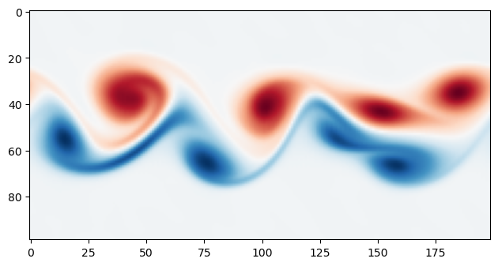

[](https://github.com/djbarker/boltzmann/actions/workflows/python-app.yml)
[](https://djbarker.github.io/boltzmann/)
[](gallery)
[](examples)

# Boltzmann

A GPU accelerated Python package for running [Lattice-Boltzmann](https://en.wikipedia.org/wiki/Lattice_Boltzmann_methods) simulations.

<p align="center">
    <picture align="center">
        <a href="https://github.com/djbarker/boltzmann/tree/master/gallery">
            
        </a>
    </picture>
    </br>
    <i>
    2D flow around a cylinder with Re=10,000 and 27 million grid cells.
    </i>
</p>

## Highlights 

- 🚀 Accelerated with [OpenCL](https://en.wikipedia.org/wiki/OpenCL).
- ⏩ Uses the efficient AA-pattern for in-place streaming & collision.
- 🎨 [Advection-diffusion](https://en.wikipedia.org/wiki/Convection%E2%80%93diffusion_equation) kernels for tracers.
- 📦 Support for 2D and 3D simulations.
- 💾 Save & re-load your simulations (checkpointing).
- 🔢 Simple interface; simluation data is exposed to Python as [`numpy`](https://numpy.org/) arrays.
- 📏 Utilities to map from physical to simulation units.
- 🔎 Utilities to output `.vti` files for analysis in [ParaView](https://www.paraview.org/)

## Get Started

> [!NOTE]
> I have run this module on Linux only (Ubuntu 24 natively, and Ubuntu 22 via WSL 2).
> There is nothing explicitly Linux specific in the code but consider this a heads-up.

### Installation

Currently the installation of this package is very manual.
To install from source you will need something to manage your Python environments ([`micromamba`](https://mamba.readthedocs.io/en/latest/user_guide/micromamba.html), for example) and a working installation of [Rust](https://www.rust-lang.org/tools/install). To actually run any simulations you will need a working OpenCL setup.

The following steps will set-up a Python environment and (editable) install the `boltzmann` module:

```bash
# create & use a new environment
$ micromamba create -n boltzmann python=3.10 maturin && micromamba activate boltzmann  
# download the repo
$ git clone git@github.com:djbarker/boltzmann.git && cd boltzmann
# build & install the module
$ maturin develop --release
```

### Running

If the steps above all worked you should now be able to use the module. 
Setting up a minimal simulation is very simple.
This example demonstrates running a small 2D simulation on the CPU and showing the result with [`matplotlib`](https://matplotlib.org/).

```python
import numpy as np
import matplotlib.pyplot as plt

from boltzmann.core import Simulation

np.random.seed(42)

# Create the simulation
tau = 0.51
sim = Simulation("cpu", [200, 100], 1 / tau)

# Set some initial condition
sim.fluid.vel[:, 40:60, 0] = 0.1
sim.fluid.rho[:] += 0.1 * np.random.uniform(-1, 1, sim.fluid.rho.shape)

# Run it
sim.iterate(3000)

# Plot it
dvydx = np.diff(sim.fluid.vel[..., 1], axis=0)[:, :-1]
dvxdy = np.diff(sim.fluid.vel[..., 0], axis=1)[:-1, :]
curl = dvydx - dvxdy
plt.imshow(curl.T, cmap="RdBu")
plt.show()
```

This should produce the plot below

<p align="center">
    <picture align="center">
        
    </picture>
    </br>
    <i>
    Basic 2D simulation showing <a href="https://en.wikipedia.org/wiki/Kelvin%E2%80%93Helmholtz_instability">Kelvin-Helmoltz instability</a>.
    </i>
</p>

The code for this example is at [`examples/basic.py`](/python/examples/basic.py).

For further explanation and more functionality check out [the full docs](https://djbarker.github.io/boltzmann/).

## Examples

There are some examples of simulations run with this package in the [gallery](/gallery/), the code for which is available under the [`examples`](/python/examples/) directory.