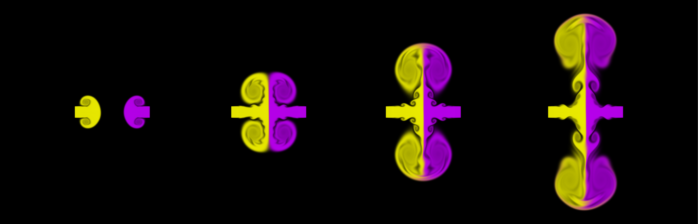

# Gallery

Some nice pictures of simulations produced with this package.
The code for all of these is included in the [examples directory (`/python/examples`)](/python/examples).
They were all run on my local desktop PC, which has an RTX 4060 Ti graphics card.

## Flow Past a Cylinder

2D simulation with 27 million grid cells at a Reynold's number of 10,000.
Code at [`vortex_street/vortex_street.py`](python/examples/vortex_street/vortex_street.py).

## Colliding Jets

An example simulation showing the use of tracers.
The simulation is of two jets colliding head-on. 
Each jet & its motion is highlighted by the tracers, here coloured yellow and purple for each jet.
Code at [`jets/jets.py`](python/examples/jets/jets.py).
