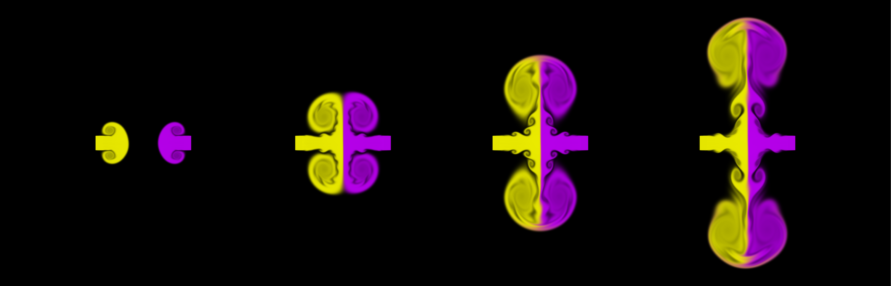

# Gallery

Some nice pictures of simulations produced with this package.
The code for all of these is included in the [examples directory (`/python/examples`)](/python/examples).
They were all run on my local desktop PC, which has an RTX 4060 Ti graphics card.

## Flow Past a Cylinder

2D simulation with 27 million grid cells at a Reynold's number of 10,000.
The flow undergoes [vortex shedding](https://en.wikipedia.org/wiki/Vortex_shedding) and is somewhat turbulent. 

_Code at [`vortex_street/vortex_street.py`](/python/examples/vortex_street/vortex_street.py)._

## Colliding Jets

An example simulation showing the use of tracers.
The simulation is of two jets colliding head-on. 
Each jet & its motion is highlighted by the tracers, here coloured yellow and purple for each jet.

_Code at [`jets_2d/jets.py`](/python/examples/jets_2d/jets.py)._

## Porous Media

    

        <image src="voronoi_velocity.png" width=48%px/>
        <image src="voronoi_tracer.png" width=48%px/>
    

Shows the flow through a periodic 2D [packed-bed](https://en.wikipedia.org/wiki/Packed_bed) with procedurally generated particles.
The simulation has 2.3 million grid cells with a Reynold's number of ~250.

_Code at [`voronoi/voronoi.py`](/python/examples/voronoi/voronoi.py)_

## Colliding Jets 3D

    

        <image src="jets_3d_velocity.png" width=48%px/>
        <image src="jets_3d_qcriterion.png" width=48%px/>
    

3D simulation showing two slightly off-center jets colliding.
The volumetric plots show the velocity magnitude (orange color-scheme) and the Q-criterion (green color-scheme).
The simulation has 64 million grid cells.

_Code at [`jets_3d/jets.py`](/python/examples/voronoi/voronoi.py)_